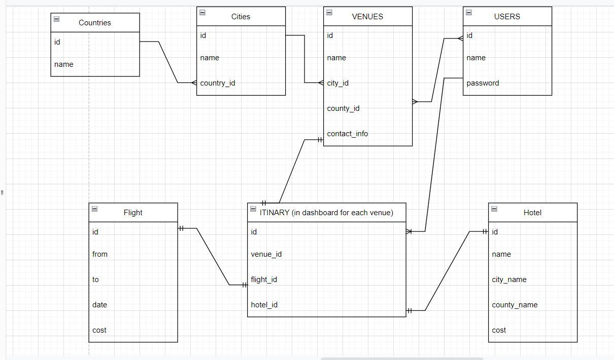
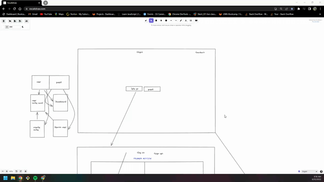

# Down-the-Isle

## Description 
Our application is intended to help users create and manage wedding invitations and allows for wedding guests to contact the wedding party via email.

## User Story
``` 
AS a newly engaged couple ❤️
WE WANT our friends all over the world to receive our personalized wedding invitation 
THEN our guests will have a glimpse of how extravagant our big day will be 
```

## Acceptance Criteria
```
GIVEN I open the web page for Down-the-Isle
WHEN I select 'Let's Go!' on the main page 
THEN I am presented with a login and sign up form

WHEN I select sign-up on the sign-up form
THEN I can enter my username and password and submit 

WHEN I enter my username and password on the login form
THEN I am taken to my dashboard 

WHEN I click on a title on the navigation bar
THEN I am presented with the corresponding section below the navigation 

WHEN I enter user dashboard I am given a presentation of cards
THEN I am able to click the corresponding card I wish to view

WHEN I click the create invitation card it redirects me to a new page with a form
THEN I can input information into the invitation card and save it

WHEN I click back to dashboard I am able to review all previous cards in selection

WHEN I click view invitation I am redirected to the view invites page
THEN I can view the inputted information I selected to see in the invitation page 
```

## Technologies Used
- Axios
- CSS
- Cloudinary
- Emailjs
- Express
- Framer Motion
- HTML
- JavaScript
- MySQL
- React
- React Bootstrap 
- React-Spring
- Sequelize

## Future Development 
- Cloudinary or local storage for image saving fully function per user
- Guest list shows mulitple guest names per invitation
- Bulk email sending with EmailJs
- User experience more interactive with invitational preview
- Allow the user to add/edit/manipluate preview and saved data before email is sent

## Screenshots
- 
- 
- 


## Contributors 
- [Hayden Kiltoff](https://github.com/hayden1773)
- [Seval Cakir](https://github.com/sevalc)
- [Daniela Velarde](https://github.com/davelarde)
- [Kristina Pang](https://github.com/KVPang)

## Links 

- [Deployed page link](https://donw-the-isle.herokuapp.com/)

- [Back-end link](https://at-the-altar.herokuapp.com/)


